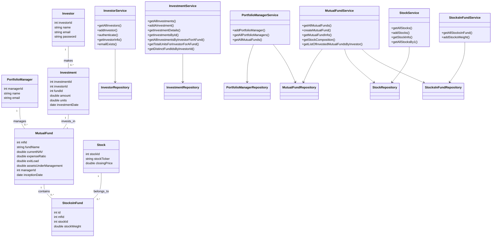
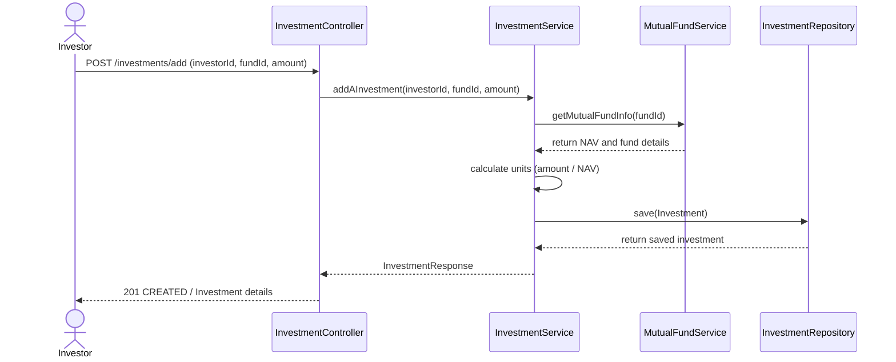
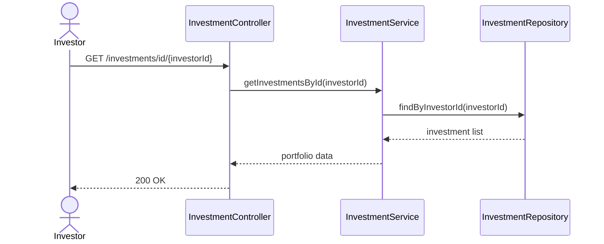
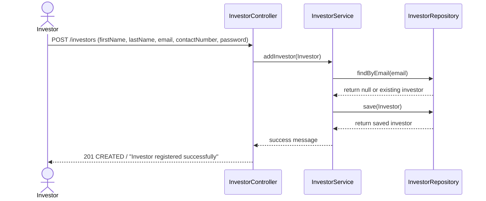
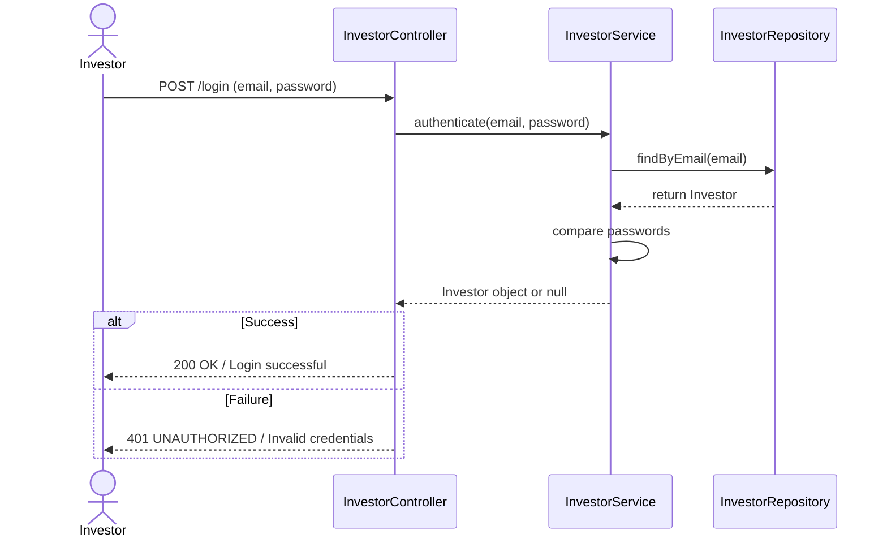
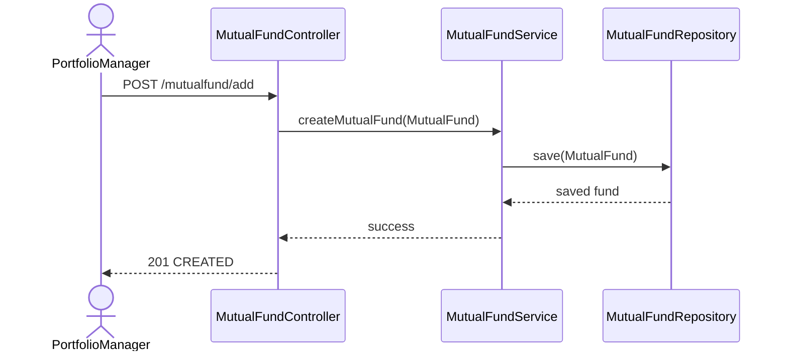

# Mutual Fund Management Backend 💰


---

## 📖 Overview  

The **Mutual Fund Management Backend** is a Spring Boot application providing **REST APIs** for managing mutual funds, investors, portfolios, stocks, and transactions.  
This backend powers the **Mutual Fund Frontend platform** and demonstrates a **full-stack Java web application** with database connectivity, secure authentication, and CRUD operations.

It is ideal for:
- 💡 Practicing Spring Boot and REST API development  
- 🏦 Financial project demos and learning  
- 📊 Handling relational data with MySQL  
- 🌐 Integrating with frontend applications  

---

## ✨ Features  

### 👩‍💻 Investor Features  
- 🔑 Investor Registration & Login  
- 📈 View Portfolio and Investment Details  
- 💵 Invest in Mutual Funds  
- 📄 View Transaction History  
- 🔍 Search for Mutual Funds & Stocks  


### 🔐 Portfolio Manager Features  
- 🛡 Portfolio Manager Login  
- 🗂 Manage Mutual Funds (create, update, delete)  
- 🗂 Manage Stocks (add, update, delete stocks)  
- 📊 View Investor Portfolios and Transactions  


### 📦 Stock & Fund Features  
- 📈 Track Stocks in Funds  
- 🔄 Update Stock Prices  
- 🏦 Assign Stocks to Mutual Funds  

  

### ⚙️ Technical Features  
- ✅ **Spring Boot MVC** for backend structure  
- ✅ **Spring Data JPA (Hibernate)** for database queries  
- ✅ **REST APIs** for frontend integration  
- ✅ **Oracle XE** for data storage  
- ✅ **Maven** for dependency management  
- ✅ **CORS Configuration** for cross-origin requests  
- ✅ Entity mapping for Investor, PortfolioManager, MutualFund, Investment, Stock, StocksInFund  

---

## 🏗️ Project Structure

Mutual_Fund_Project-master

├── **src/** – Source files  
│   └── **main/** – Main application files  
│       ├── **java/com/project/** – Java packages  
│       │   ├── **controller/** – REST API endpoints  
│       │   │   ├── InvestmentController.java – Handles investment-related requests  
│       │   │   ├── InvestorController.java – Handles investor-related requests  
│       │   │   ├── MutualFundController.java – Handles mutual fund CRUD  
│       │   │   ├── PortfolioManagerController.java – Handles portfolio manager actions  
│       │   │   ├── StockController.java – Handles stock data endpoints  
│       │   │   └── StocksInFundController.java – Handles stocks within mutual funds  
│       │   │  
│       │   ├── **service/** – Business logic for entities  
│       │   │   ├── InvestmentService.java – Investment logic  
│       │   │   ├── InvestorService.java – Investor operations  
│       │   │   ├── MutualFundService.java – Mutual fund operations  
│       │   │   ├── PortfolioManagerService.java – PM operations  
│       │   │   ├── StockService.java – Stock logic  
│       │   │   └── StocksInFundService.java – Stocks in fund management  
│       │   │  
│       │   ├── **repository/** – Database access layer (Spring Data JPA)  
│       │   │   ├── InvestmentRepository.java  
│       │   │   ├── InvestorRepository.java  
│       │   │   ├── MutualFundRepository.java  
│       │   │   ├── PortfolioManagerRepository.java  
│       │   │   ├── StockRepository.java  
│       │   │   └── StocksInFundRepsoitory.java  
│       │   │  
│       │   ├── CorsConfig.java – Cross-origin resource sharing configuration  
│       │   ├── Investment.java – Investment entity  
│       │   ├── Investor.java – Investor entity  
│       │   ├── MutualFund.java – Mutual fund entity  
│       │   ├── PortfolioManager.java – Portfolio manager entity  
│       │   ├── Stock.java – Stock entity  
│       │   ├── StockIdentifier.java – Unique stock identifiers  
│       │   └── StocksInFund.java – Stocks mapped to funds  
│       │  
│       └── MainApp.java – Spring Boot main application class  
│  
├── **resources/** – Configuration and properties  
│   └── application.properties – Database, server, and Spring configurations  
│  
├── **pom.xml** – Maven dependencies and build configuration  


 ---

## 🌐 API Endpoints & Service Layer Overview

### Portfolio Manager Endpoints

| Method | Endpoint                                  | Description                        |
| ------ | ----------------------------------------- | ---------------------------------- |
| GET    | `/portfoliomanagers`                      | List all portfolio managers        |
| POST   | `/portfoliomanagers/add`                  | Add a new portfolio manager        |
| GET    | `/portfoliomanagers/getAllMF/{managerId}` | Get all mutual funds managed by PM |

PortfolioManagerService Methods:
- addPortfolioManager(PM) → Add a new PM
- getAllPortfolioManagers() → List all PMs
- getAllMutualFunds(managerId) → Funds managed by PM

### Investor Endpoints & Service

| Method | Endpoint                     | Description             |
| ------ | ---------------------------- | ----------------------- |
| POST   | `/investors`                 | Register a new investor |
| POST   | `/login`                     | Login an investor       |
| GET    | `/investors`                 | Get all investors       |
| GET    | `/investors/id/{investorId}` | Get investor info by ID |


InvestorService Methods:
- authenticate(email, password) → Validate and login investor
- getAllInvestors() → List all investors
- addInvestor(Investor) → Add new investor
- emailExists(email) → Check if email already exists
- getInvestorInfo(id) → Fetch investor details


### Investment Endpoints & Service

| Method | Endpoint                                      | Description                             |
| ------ | --------------------------------------------- | --------------------------------------- |
| GET    | `/investments`                                | List all investments                    |
| POST   | `/investments/add`                            | Record a new investment                 |
| GET    | `/investments/id/{investorId}`                | Get investor's portfolio                |
| GET    | `/investments/investmentid/{investmentId}`    | Get investment details by ID            |
| GET    | `/investments/getunits/{investorId}/{fundId}` | Get total units for investor for a fund |

InvestmentService Methods:
- getAllInvestments() → List all investments
- addAInvestment(Investment) → Add investment
- getInvestmentDetails(id) → Single investment
- getInvestmentsById(investorId) → Investments by investor
- getAllInvestmentsByInvestorForAFund(investorId, fundId) → Investments for a specific fund
- getTotalUnitsForInvestorForAFund(investorId, fundId) → Total units for a fund
- getDistinctFundIdsByInvestorId(investorId) → List distinct funds invested in


### Mutual Fund Endpoints & Service

| Method | Endpoint                             | Description                            |
| ------ | ------------------------------------ | -------------------------------------- |
| GET    | `/mutualfunds`                       | List all mutual funds                  |
| POST   | `/mutualfund/add`                    | Create a new mutual fund               |
| GET    | `/mutualfunds/id/{mfid}`             | Get mutual fund details                |
| GET    | `/mutualfund/getstockweights/{mfid}` | Get stock composition of fund          |
| GET    | `/investor/mfs/{investorId}`         | List mutual funds invested by investor |


MutualFundService Methods:
- getAllMutualFunds() → List all funds
- createMutualFund(MutualFund) → Add new fund
- getMutualFundInfo(fundId) → Fund details
- getStockComposition(fundId) → Stocks and weights
- getListOfInvestedMutualFundsByInvestor(investorId) → Funds an investor invested in

### Stock Endpoints & Service

| Method | Endpoint               | Description                          |
| ------ | ---------------------- | ------------------------------------ |
| GET    | `/stocks`              | List all stocks                      |
| GET    | `/stocks/byid`         | List all stocks (alternate endpoint) |
| POST   | `/stocks/add`          | Add a new stock                      |
| GET    | `/stocks/id/{stockId}` | Get stock info by ID                 |

StockService Methods:
- getAllStocks() → List all stocks
- addStocks(Stock) → Add a new stock
- getStockInfo(stockId) → Stock details
- getAllStocksBy1() → Custom query for stocks


### Stocks in Fund Endpoints & Service

| Method | Endpoint            | Description                           |
| ------ | ------------------- | ------------------------------------- |
| GET    | `/stocksinfund`     | List all stocks in all funds          |
| POST   | `/stocksinfund/add` | Add or update stock weights in a fund |


StocksInFundService Methods:
- getAllStocksInFund() → List stocks in all funds
- addStocksWeight(StocksInFund) → Update stock weights in a fund
 

---


## 📐 System Architecture

### Class Diagram



---

### 🧩 Entity Relationships

  
   ```mermaid
erDiagram
    %% Relationships
    INVESTOR ||--o{ INVESTMENT : makes
    PORTFOLIOMANAGER ||--o{ MUTUALFUND : manages
    MUTUALFUND ||--o{ INVESTMENT : has
    MUTUALFUND ||--o{ STOCKSINFUND : contains
    STOCK ||--o{ STOCKSINFUND : belongs_to

    %% Entities
    INVESTOR {
        int investorId
        string name
        string email
        string password
    }

    PORTFOLIOMANAGER {
        int managerId
        string name
        string email
    }

    MUTUALFUND {
        int mfId
        string fundName
        double currentNAV
        double expenseRatio
        double exitLoad
        double assetsUnderManagement
        int managerId
        date inceptionDate
    }

    INVESTMENT {
        int investmentId
        int investorId
        int fundId
        double amount
        double units
        date investmentDate
    }

    STOCK {
        int stockId
        string stockTicker
        double closingPrice
    }

    STOCKSINFUND {
        int id
        int mfId
        int stockId
        double stockWeight
    }


```

---


## 🔄 Application Flows (Sequence Diagrams)


###  Investment Flow



---


### View Investor Portfolio Flow



---


### Investor Registration



---


### Investor Login



---


### Mutual Fund Creation Flow (Portfolio Manager)



---


## 🛠️ Technologies Used

- **Java 17**
- **Spring Boot 3.1.0**
- **Spring Data JPA / Hibernate**
- **Oracle XE**
- **Maven 3.8+**
- **REST APIs**
- **CORS Configuration**
- **GitHub for version control**

---


## 🔐 Security & Validation

- Authentication implemented using email & password verification
- Password validation handled in InvestorService
- Business logic isolated in Service layer
- Input validation performed before persistence
- Database access restricted via Repository layer
- Clear separation of concerns:
   - Controller → Request handling
   - Service → Business logic
   - Repository → Data persistence

---


## 🚀 Getting Started  

### 1️⃣ Clone the repository
git clone https://github.com/jasmine-1612/Mutual-Fund-Platform-backend.git
cd Mutual_Fund_Project-master

### 2️⃣ Configure the database in SQL Developer (Oracle XE)

Open SQL Developer and create a new schema (user) for the application. Example:

```properties
CREATE USER mutualfunddb IDENTIFIED BY your_password;
GRANT CONNECT, RESOURCE, CREATE SESSION TO mutualfunddb;
```

Grant privileges for CRUD operations on tables:

```properries
GRANT SELECT, INSERT, UPDATE, DELETE ON mutualfunddb.* TO mutualfunddb;
```

Update the database credentials in application.properties using environment variables.


### 3️⃣ Update application.properties

```properties
# Tomcat server port
server.port=8188

# Oracle Database Configuration
spring.datasource.url=jdbc:oracle:thin:@localhost:1521/xepdb1
spring.datasource.username=${DB_USERNAME}
spring.datasource.password=${DB_PASSWORD}
spring.datasource.driver-class-name=oracle.jdbc.OracleDriver

# JPA / Hibernate Configuration
spring.jpa.database-platform=org.hibernate.dialect.Oracle12cDialect
spring.jpa.hibernate.ddl-auto=none
spring.jpa.show-sql=true
spring.jpa.properties.hibernate.format_sql=true
```

### 4️⃣ Build and run the Spring Boot application
mvn spring-boot:run

### 5️⃣ Access the API
 Base URL: http://localhost:8188/


---


## ⚙️ Application Configuration

### Server
- The application runs on port **8188**

### Database
- Database: **Oracle XE**
- Service name: **xepdb1**

Before running the application, set the following environment variables:

---


## 🚀 Future Enhancements
- JWT authentication with role-based access
- Password encryption using BCrypt
- Pagination & sorting for large datasets
- Swagger / OpenAPI documentation
- Deployment using Docker & AWS

---

## ⚡ Notes & Additional Setup

- Ensure **Java 17** is installed and configured.  
- Ensure **SQL Developer** is running.  
- Update **application.properties** with correct credentials.  
- Use **Postman** or any REST client to test endpoints.  
- JWT authentication token should be included in headers if implemented.

---


## 📌 License

This project is **open source** under the [MIT License](LICENSE).  

---

## 🤝 Contributions

- Fork the repository  
- Create a new branch (`git checkout -b feature/YourFeature`)  
- Commit your changes (`git commit -m 'Add some feature'`)  
- Push to the branch (`git push origin feature/YourFeature`)  
- Open a Pull Request  

